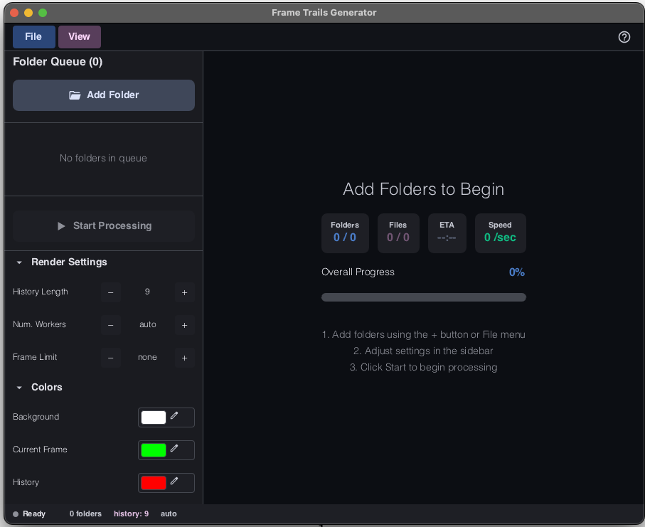
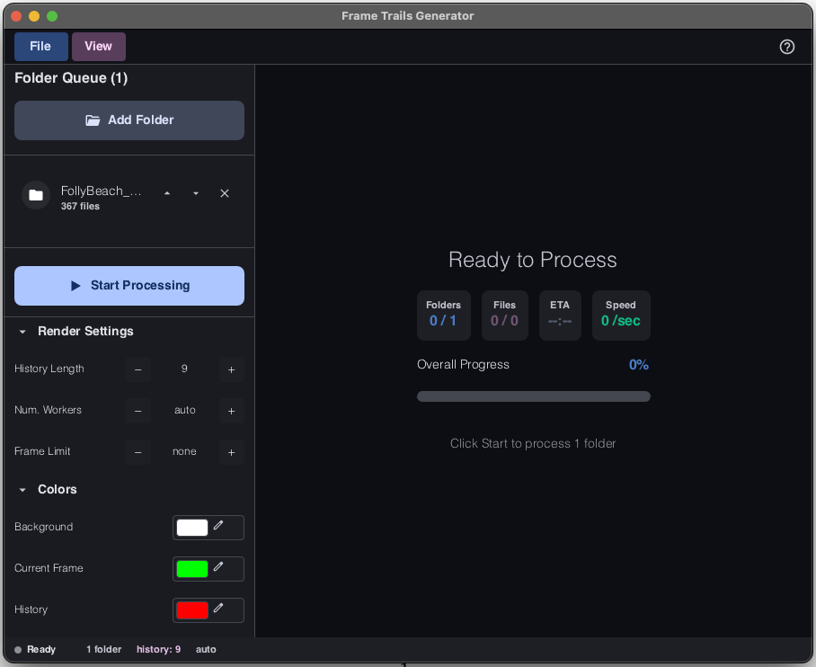
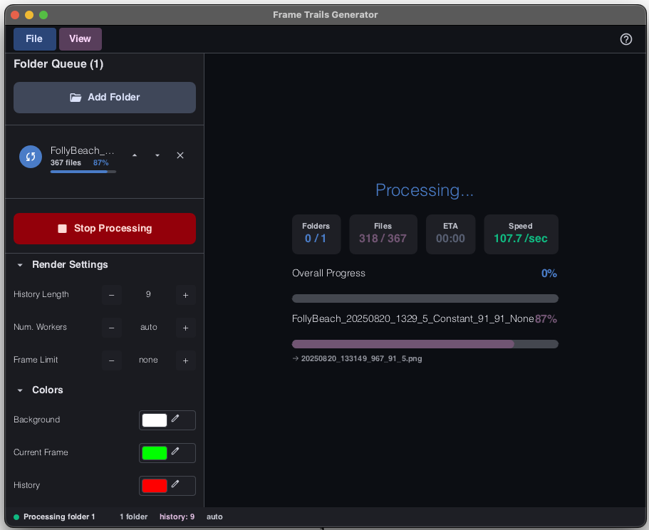
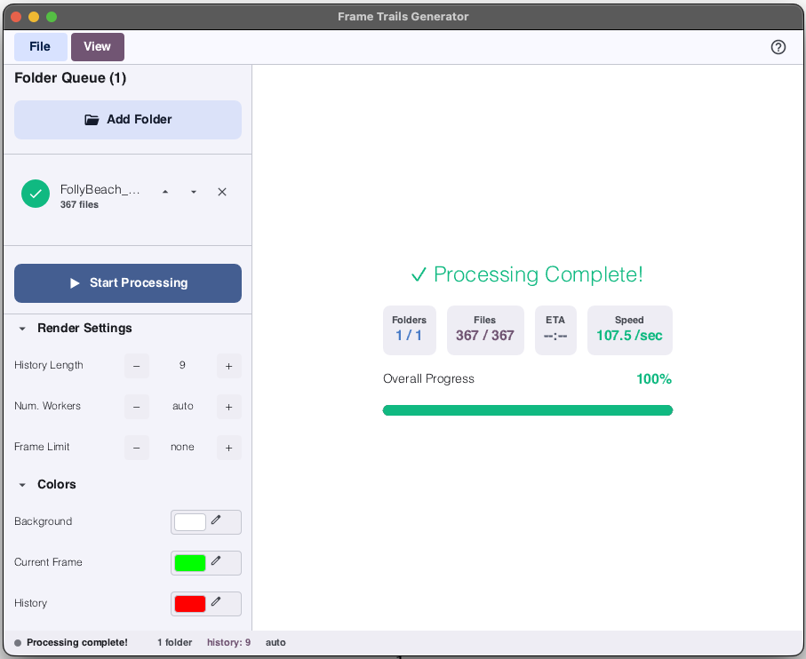
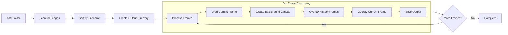
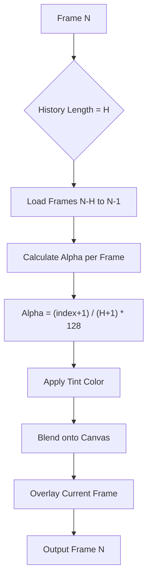
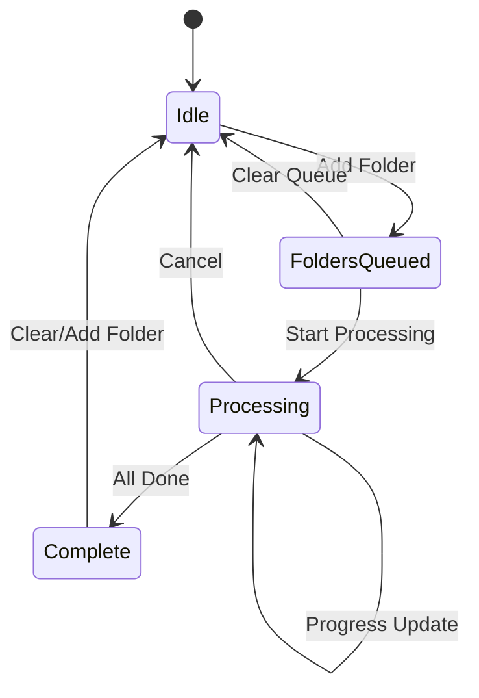

# FrameTrails

> **A high-performance GUI application for batch generating motion trail effects from image sequences.**

Developed at the **[IMSEL Lab](https://github.com/IMSEL-Lab)** (Integrated Multiphysics and Systems Engineering Laboratory), Department of Mechanical Engineering, **University of South Carolina**.

Built with [Slint](https://slint.dev/) for a modern, responsive interface and powered by Rust for blazing-fast parallel processing.

---

## Features

- **Modern GUI** — Clean, intuitive interface with dark/light mode support
- **Batch Processing** — Queue multiple folders and process thousands of frames efficiently
- **Parallel Processing** — Multi-threaded rendering utilizing all available CPU cores
- **Customizable Colors** — Full hex color picker for background, current frame, and history trails
- **Adjustable Trail Length** — Control how many previous frames contribute to the motion trail
- **Real-time Progress** — Live progress bars, ETA, and files-per-second statistics
- **Persistent Settings** — Your preferences are saved between sessions
- **Frame Limit** — Optional limit for processing a subset of frames (useful for testing)

---

## Screenshots

### Initial State (Dark Mode)
*Ready to add folders for processing*



### Folder Loaded
*Image folder queued and ready for processing*



### Settings Help Panel
*Hover over settings for detailed explanations of each parameter*


### Color Picker
*Full RGB color selection with hex input support*


### Processing in Progress
*Real-time progress tracking with ETA and throughput statistics*



### Processing Complete
*Successfully converted all frames in the queue*

| Dark Mode | Light Mode |
|-----------|------------|
|  |  |

---

## Quick Start

### macOS Installation

Download and mount the DMG file, then drag **FrameTrails.app** to your Applications folder.

Alternatively, double-click `FrameTrails.app` directly from the project directory to run.

### Build from Source

**Prerequisites**: Rust 1.70+

```bash
cd frame-trails

# Build release version (much faster for batch processing)
cargo build --release

# Run the GUI
cargo run --release
```

### Cross-Platform Builds

This application is built with Slint, which supports Windows, Linux, and macOS. Pre-built binaries for Windows and Linux are available upon request — please open an issue or contact the maintainers.

---

## How to Use

### Step-by-Step Workflow

1. **Add Folders** — Click "Add Folder" to queue directories containing image frames (PNG, JPG, BMP, TGA, GIF supported)

2. **Configure Settings** — Adjust processing parameters in the settings panel:
   - **History Length**: Number of previous frames to include in the trail (default: 5)
   - **Background Color**: Color for areas with no motion trail
   - **Current Frame Color**: Color tint for the current frame overlay
   - **History Color**: Color tint for the trailing frames (fades with age)
   - **Threads**: Number of parallel processing threads (0 = auto-detect)
   - **Limit**: Optional frame limit for testing (0 = process all)

3. **Start Processing** — Click "Start Processing" to begin batch conversion

4. **Monitor Progress** — Watch real-time progress with ETA and throughput statistics

5. **Collect Output** — Find processed frames in a sibling folder with `_trail_N` suffix

### Output Location

Output is automatically saved to a sibling folder with `_trail_N` suffix, where N is the history length.

**Example**: Processing `/data/video_frames/` with history length 5 creates `/data/video_frames_trail_5/`

### Tips for Best Results

- Use sequentially numbered image files for proper frame ordering
- Higher history length creates longer, more visible trails
- Use contrasting colors for current frame and history for clarity
- Set thread count to 0 to automatically use all CPU cores

---

## Technical Implementation

### Algorithm Overview

FrameTrails generates motion trail effects by compositing each frame with a configurable number of preceding frames. The algorithm:

1. **Loads** each frame in sequence
2. **Creates** a background canvas with the specified background color
3. **Overlays** history frames with progressively increasing opacity (older = more transparent)
4. **Applies** a color tint to each overlay based on pixel intensity
5. **Composites** the current frame on top with full opacity
6. **Saves** the result using the original filename

### Color Tinting Process

Each pixel is converted to grayscale intensity, then multiplied by the tint color:

```
intensity = 0.299 * R + 0.587 * G + 0.114 * B
tinted_pixel = tint_color * intensity * alpha
```

This creates a false-color effect where bright regions show the tint color and dark regions remain dark.

### Parallel Processing Strategy

- Uses `rayon` for work-stealing parallelism
- Each frame is processed independently (embarrassingly parallel)
- Progress updates throttled to 100ms intervals to minimize UI overhead
- Configurable thread pool size for resource management

---

## Program Architecture

```
frame-trails/
├── src/
│   ├── main.rs        # GUI entry point, callbacks, and state management
│   ├── processing.rs  # Core frame trails rendering logic (parallel)
│   ├── queue.rs       # Folder queue management and file discovery
│   └── config.rs      # Settings persistence (JSON)
├── ui/
│   ├── appwindow.slint   # Main window layout and components
│   ├── app_theme.slint   # Theme definitions (dark/light)
│   ├── components/       # Reusable UI components
│   └── material/         # Material design components
├── figures/              # Documentation screenshots
└── Cargo.toml
```

### Module Breakdown

| Module | Purpose |
|--------|---------|
| `main.rs` | Application entry point, Slint GUI initialization, callback handlers for all UI events |
| `processing.rs` | Frame trail generation algorithm, parallel processing with Rayon, progress reporting |
| `queue.rs` | Folder queue data structures, image file discovery and sorting |
| `config.rs` | Settings serialization/deserialization, persistent storage in user config directory |

---

## Processing Pipeline Flowchart



### History Frame Overlay Logic



### Application State Flow



---

## Configuration Options

| Option | Default | Description |
|--------|---------|-------------|
| History Length | 5 | Number of previous frames to include in the trail |
| Background Color | `#000000` | Canvas background color (hex) |
| Current Color | `#00ff00` | Tint color for the current frame (green) |
| History Color | `#ff7f00` | Tint color for history frames (orange) |
| Threads | 0 | Processing threads (0 = auto, uses all cores) |
| Limit | 0 | Maximum frames to process (0 = no limit) |

Settings are automatically saved to the system configuration directory:
- **macOS**: `~/Library/Application Support/com.radical.frame_trails_gui/`
- **Linux**: `~/.config/frame_trails_gui/`
- **Windows**: `C:\Users\<user>\AppData\Roaming\radical\frame_trails_gui\`

---

## Dependencies

| Crate | Purpose |
|-------|---------|
| `slint` | Cross-platform GUI framework |
| `image` | Image loading/saving and manipulation |
| `rayon` | Parallel iterator processing |
| `rfd` | Native file dialogs |
| `serde` + `serde_json` | Settings serialization |
| `directories` | Platform-specific config paths |
| `anyhow` | Error handling |
| `num_cpus` | CPU core detection |

---

## Supported Image Formats

| Format | Extensions |
|--------|------------|
| PNG | `.png` |
| JPEG | `.jpg`, `.jpeg` |
| BMP | `.bmp` |
| TGA | `.tga` |
| GIF | `.gif` |

---

## Acknowledgments

This project was developed at the **Integrated Multiphysics and Systems Engineering Laboratory (iMSEL)**, Department of Mechanical Engineering, University of South Carolina.

- Lab GitHub: [github.com/IMSEL-Lab](https://github.com/IMSEL-Lab)

---

## License

MIT License — See [LICENSE](LICENSE) for details.

---

## Contributing

Contributions welcome! Please open an issue or submit a PR.
